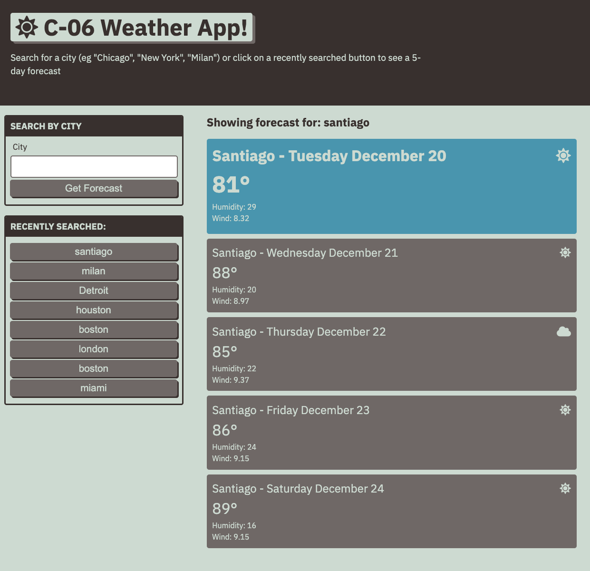

# 06 Server-Side APIs: Weather Dashboard
## Intro
A client side application designed to provide a five-day forecast by making a live call to the OpenWeather API.

It shows the day's date, weather status icon, temperature, humidity, and wind speed. 

## Directions
To get started, search for a city name to bring up the relevant forecast, or click on the history buttons to return to a previous search.

See below for a screenshot of the application

## Screenshot
